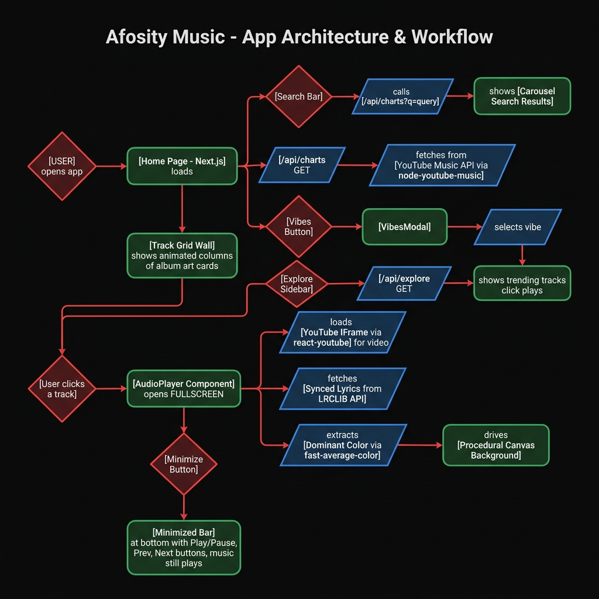

# Afosity Music — Technical Report

> **Last Updated:** 2026-08-15  
> **Version:** 1.1.0 — Minimized Player Bar with Playback Controls



---

## 1. Project Overview

**Afosity Music** is a modern, client-side music streaming web application built with **Next.js 16** and **React 19**. It provides users with a visually immersive music discovery and playback experience, powered by the YouTube Music catalog. The app features a dynamic animated grid of album art, a full-screen audio player with synced lyrics, AI-powered vibe-based search, and a persistent minimized player bar.

---

## 2. Technology Stack

| Layer | Technology | Purpose |
|---|---|---|
| **Framework** | Next.js 16.3 | App router, API routes, SSR |
| **UI** | React 19.2 | Component-based UI |
| **Styling** | Tailwind CSS v4 | Utility-first styling |
| **Music Data** | `node-youtube-music` | Fetch YouTube Music charts & search |
| **Video Player** | `react-youtube` | Embed YouTube IFrame with API access |
| **Synced Lyrics** | LRCLIB API | Time-synced LRC lyrics |
| **Lyrics Fallback** | YouTube Transcript API | Caption-based lyric sync |
| **Color Analysis** | `fast-average-color` | Extract dominant color from album art |
| **Icons** | `lucide-react` | UI icons |
| **Animations** | Vanilla CSS | Scrolling columns, transitions |

---

## 3. Architecture & Data Flow

### 3.1 Application Startup
```
User opens http://localhost:3001
  → Next.js serves the Home Page (page.tsx)
  → useEffect fires → GET /api/charts
  → node-youtube-music fetches trending tracks from YouTube Music
  → Track data is stored in React state
  → Animated Grid Wall renders with album art columns
```

### 3.2 Music Playback Flow
```
User clicks album art card
  → handlePlayTrack(track) fires
  → setCurrentTrack(track) + setIsPlayerMinimized(false)
  → <AudioPlayer /> renders in FULLSCREEN mode

  AudioPlayer simultaneously:
  ├─ Loads YouTube IFrame (react-youtube) → video plays (autoplay: 1)
  ├─ Fetches from LRCLIB API → synced LRC lyrics
  │    └─ Fallback: YouTube Transcript API → caption lyrics
  │    └─ Fallback: lyrics.ovh API → plain lyrics
  ├─ Loads album art image → fast-average-color extracts dominant color
  │    └─ Color drives the Procedural Canvas Background animation
  └─ setInterval polls player.getCurrentTime() at 5fps
       → Updates active lyric line, auto-scrolls lyrics view
```

### 3.3 Minimized Player Flow
```
User clicks Minimize button (ChevronDown icon, top-left of fullscreen)
  → isPlayerMinimized = true
  → Full-screen overlay hides (opacity-0, pointer-events-none)
  → YouTube player moves off-screen (top: -1000px) but stays MOUNTED
  → Song continues playing uninterrupted in background
  → Bottom bar (h-20) appears with glass-morphic style:
      [Album Art | Track Title | Artist] [⏮ Prev] [⏯ Play/Pause] [⏭ Next] [⬆ Expand] [✕ Close]

User clicks bottom bar left side (art/title area)
  → onMaximize() → isPlayerMinimized = false → fullscreen restores seamlessly
```

### 3.4 Search Flow
```
User types query → submits search form
  → GET /api/charts?q={query}
  → node-youtube-music.searchSongs(query)
  → Carousel view replaces Grid Wall
  → <CarouselSearchResults /> renders tracks in a horizontal Swiper carousel
  → User clicks track → handlePlayTrack(track) → AudioPlayer
```

### 3.5 Vibes & Explore Flow
```
Vibes Button (Sparkles icon, below search bar)
  → <VibesModal /> opens with curated mood/genre options
  → User selects a vibe mood
  → vibe name passed to fetchMusic() as search query
  → Carousel results render

Explore Sidebar (TrendingUp icon, top-left)
  → GET /api/explore
  → Returns curated trending playlists & tracks
  → User clicks a track → handlePlayTrack(track) → AudioPlayer
```

---

## 4. Component Breakdown

### `src/app/page.tsx` — Root Page
The main orchestrator. Manages all global state:
- `tracks` — current track list
- `currentTrack` — currently playing track
- `isPlayerMinimized` — controls player UI mode (full / mini bar)
- `activeSearchTerm` — current search query
- `isSidebarOpen` / `isVibesOpen` — overlay state

Navigation handlers:
- `handlePlayTrack(track)` — plays a track and opens fullscreen player
- `handleNextTrack()` — finds next track in `tracks[]` array, loops around
- `handlePrevTrack()` — finds previous track in `tracks[]` array, loops around

### `src/components/AudioPlayer.tsx`
The most complex component. Handles:
- **Props:** `currentTrack`, `onClose`, `isMinimized`, `onMinimize`, `onMaximize`, `onNext`, `onPrev`
- Full-screen video + lyrics + album art view
- Minimized bottom bar view with controls
- `isPlaying` state synced with `onStateChange` from YouTube IFrame
- `togglePlay()` calls `player.pauseVideo()` or `player.playVideo()` directly
- React-YouTube player API integration with `onReady` + `onStateChange` handlers
- 3-stage lyrics fetching pipeline (LRCLIB → YouTube Transcript → lyrics.ovh)
- Color extraction from album art → background theming
- Active lyric line tracking via `setInterval` polling `getCurrentTime()`

### `src/components/ProceduralBackground.tsx`
A canvas element that renders a generative, color-reactive ambient background. The dominant color extracted from the album art is passed as a prop and drives the animation.

### `src/components/CarouselSearchResults.tsx`
Renders search results in a horizontal Swiper.js carousel. Includes hover states with track info and play buttons.

### `src/components/ExploreSidebar.tsx`
A slide-in sidebar overlay that displays trending music categories and tracks from the `/api/explore` endpoint.

### `src/components/VibesModal.tsx`
A pop-up modal with curated mood/genre "vibe" options (e.g., chill, workout, sad, party) that map to search queries.

### `src/components/CustomCursor.tsx`
A custom animated cursor that replaces the browser default, adding a premium feel.

---

## 5. API Routes (`src/app/api/`)

| Endpoint | Description |
|---|---|
| `GET /api/charts` | Returns trending tracks. Accepts optional `?q=` for search. |
| `GET /api/explore` | Returns curated playlists and trending categories. |
| `GET /api/transcript?videoId=&lang=` | Fetches YouTube captions for a video, used as lyrics fallback. |

---

## 6. Feature Changelog

| Date | Feature | Description |
|---|---|---|
| Aug 14, 2026 | **Portable API Key** | Added a UI modal to accept and save a custom YouTube Data API v3 key to local storage. API routes now accept `x-youtube-api-key` header to allow cloned repos to run out-of-the-box. |
| Aug 15, 2026 | **Minimized Audio Player** | Redesigned the Audio Player to support a sleek bottom bar mode. Added `isPlayerMinimized` global state. Re-implemented track navigation logic (`Next` / `Prev` / `Play` / `Pause`) directly into the player interface. |
| Aug 15, 2026 | **Easy Startup Scripts** | Added Mac setup script (`.command`), a `HOW_TO_OPEN.txt` guide, and updated the Windows `.bat` script to automatically check for Node.js, making the app easier to run for non-technical users. |
| Aug 16, 2026 | **Documentation Updates** | Updated report to reflect Portable API Key integration and updated project versioning. |

---

## 7. Feature Status

| Feature | Status | Notes |
|---|---|---|
| Search | ✅ Active | Real-time querying against YouTube Music API. |
| Explore / Trending | ✅ Active | Discovers trending music and popular playlists. |
| Audio Player (Fullscreen) | ✅ Active | YouTube iframe embedding with synchronized lyrics. |
| Audio Player (Minimized) | ✅ Active | Persists playback across navigation with bottom bar controls. |
| Portable API Key | ✅ Active | Users can input their own API key via the UI to use the app locally. |
| Lyrics Sync | ✅ Active | Polling at 5fps to sync transcripts with video current time. |
| Vibes Generator | ✅ Active | Modal with mood-based suggestions. |
| Custom animated cursor | ✅ | |
| YouTube official video embedded | ✅ | |
| Responsive layout | ✅ | |
| Privacy-friendly YouTube embed (`youtube-nocookie.com`) | ✅ | |

---

## 8. Startup Instructions

The app runs locally on `http://localhost:3001`.

**To start:** 
- **Windows:** Double-click `Start Afosity Music.bat` in the project root (`e:\Afosity Music\`).
- **Mac:** Double-click `Start Afosity Music (Mac).command`.

*For non-technical users, refer to `HOW_TO_OPEN.txt` for step-by-step instructions.*

**Requirements:**
- Node.js installed
- (Optional) A valid `YOUTUBE_API_KEY` set in `e:\Afosity Music\.env.local` if not using the in-app portable key feature.
